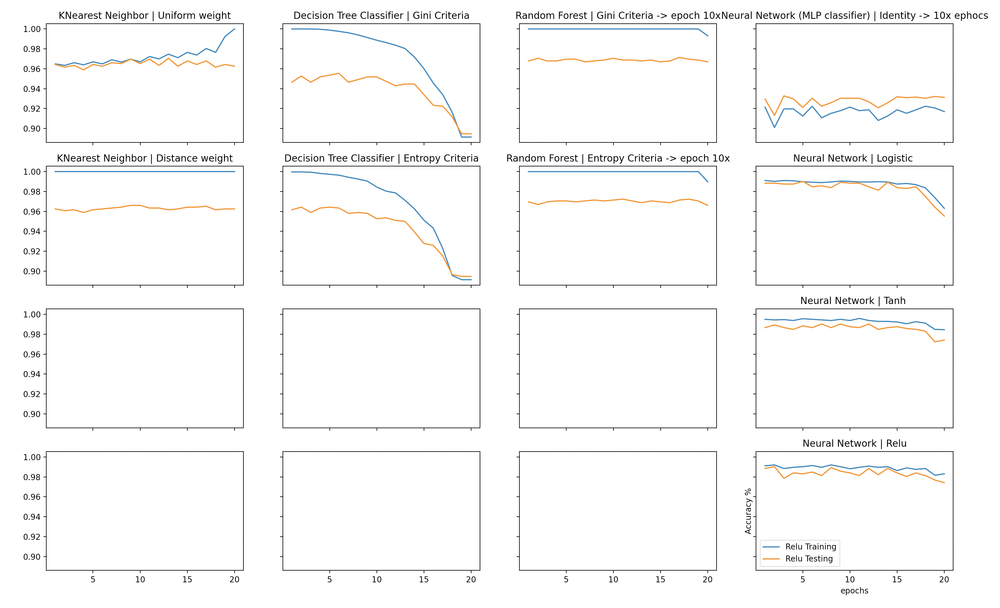

# Scraping and visualizing the winning Euro Jackpot numbers

Python script that visualizes the learning capabilities of the most popular model classifiers, as well as making educated predictions to a valid future lottery ticket.
It uses the data from the results archive on the euro-jackpot website
https://www.euro-jackpot.net/en/results-archive-2020

It is being trained on about 10% success data and 90% created dummy data

Give it a try to see if your lottery ticket will pass this test




Requirements
1. matplotlib
2. numpy
3. BeautifulSoup
4. Requests

## You can install these libraries with 

```bash
python3 -m pip install matplotlib numpy BeautifulSoup requests
```

```bash
git clone https://github.com/Nidocq/VisualizeTheLottery.git
```

## To run the script you simply type

```bash
python3 main.py
```


